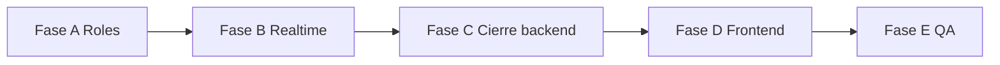

# Plan de construcción (ejecutable)

## Objetivo
Ordenar el trabajo pendiente para llevar el MVP a estado construible, con el modelo de roles definido (Representante distrital + Secretaría = administración; Presidentes de club = votantes) y prioridad clara por fases.

Referencias: [01-mvp-functional-breakdown](01-mvp-functional-breakdown.md), [02-domain-events-and-data-model](02-domain-events-and-data-model.md), [03-backend-implementation-plan](03-backend-implementation-plan.md), [04-frontend-implementation-plan](04-frontend-implementation-plan.md), [00-master-roadmap](00-master-roadmap.md).

---

## Estado actual (resumen)

| Capa | Hecho | Pendiente |
|------|--------|-----------|
| **Backend** | NestJS, Prisma, Auth JWT, guards por Role, CRUD meetings/topics/voting/speaking-queue/timers, RealtimeGateway con snapshot y rooms, AuditService, History + export votos (JSON) | Realtime sin JWT (userId en payload), presencia (join/leave) no registrada, opcional vote.submit por WS, revisión audit actions, export CSV como respuesta HTTP, alineación roles en schema/seed |
| **Frontend** | Next.js, login, admin/meetings CRUD, salas live admin y participante, votación, cola de palabra, timers, historial, AuthContext | Alinear rutas/permisos con “admin” = Representante + Secretaría y “participante” = Presidente de club; reconexión y UX según plan 04 |
| **Modelo de roles** | Documentado en 01 y 02 | Schema/seed y guards aún usan PARTICIPANT/SECRETARY/PRESIDENT; decidir si renombrar enum o mapear en código |

---

## Fase A — Roles en backend (schema, seed, guards)

Objetivo: que el sistema distinga claramente administración (2 roles) y votantes (presidentes de club).

### A.1 Decisión de modelo en schema

- **Opción 1 (sin migración de enum):** Mantener `Role`: PARTICIPANT, SECRETARY, PRESIDENT. Convención: SECRETARY = Secretaría, PRESIDENT = Representante distrital; los que votan son usuarios con al menos un `Membership` con `isPresident: true` en un club (y están en MeetingParticipant con canVote). PARTICIPANT no se usa para lógica de voto.
- **Opción 2 (cambiar enum):** Renombrar a ej. DISTRICT_REP, SECRETARY y eliminar PRESIDENT del enum; “presidente de club” solo por Membership.isPresident. Requiere migración y actualizar todos los usos de Role en API y frontend.

Recomendación: Opción 1 para no tocar migraciones ni front; documentar en seed y en 02 la convención.

### A.2 Seed

- En [apps/api/prisma/seed.ts](apps/api/prisma/seed.ts): crear al menos un usuario con rol Secretaría, uno con rol Representante distrital (usar PRESIDENT para este si se sigue Opción 1) y varios usuarios que sean presidentes de club (Membership con isPresident: true en un club; pueden tener Role PARTICIPANT). Asignar miembros al club distrito (Secretaría, Representante) y a clubes (presidentes).
- Asegurar que reuniones de ejemplo tengan como participantes a presidentes de club (MeetingParticipant con canVote: true).

### A.3 Guards y permisos

- Endpoints que hoy exigen `@Roles(Role.SECRETARY, Role.PRESIDENT)` quedan como “solo administración”; si se usa Opción 1, PRESIDENT = Representante distrital y SECRETARY = Secretaría.
- Donde haga falta “solo quien puede votar en esta reunión”, validar: usuario está en MeetingParticipant de esa reunión con canVote: true (y opcionalmente que tenga Membership.isPresident en algún club). No basar solo en User.role.

Definition of done Fase A: seed con los tres tipos de usuario; administración puede hacer CRUD y abrir/cerrar votación; solo participantes con canVote (presidentes de club) pueden enviar voto.

---

## Fase B — Realtime seguro y presencia

Objetivo: WebSocket autenticado y registro de presencia (joined/left).

### B.1 Autenticación en el gateway

- Leer JWT del handshake (query `token` o auth header) en [apps/api/src/realtime/realtime.gateway.ts](apps/api/src/realtime/realtime.gateway.ts).
- Validar JWT (reutilizar JwtService o lógica compartida) y obtener userId (y rol).
- En `meeting.join`, usar solo el userId del token; no confiar en el payload para userId.
- Rechazar join si no hay token o es inválido.

### B.2 Presencia (participant.joined / participant.left)

- Tras unir al cliente a la room: si es MeetingParticipant de esa reunión, actualizar attendanceStatus a JOINED y joinedAt si aplica; registrar AuditLog participant.joined; emitir meeting.presence.updated (o broadcastSnapshot).
- En leave_meeting y en handleDisconnect: detectar rooms del socket (guardar en client.data.meetingIds al hacer join); por cada meeting, actualizar participante a LEFT, auditar participant.left, emitir presencia.
- Inyectar en el gateway lo necesario (PrismaService, AuditService o un PresenceService) para no duplicar lógica.

Definition of done Fase B: cliente solo puede hacer meeting.join con JWT válido; al entrar/salir se actualiza presencia y se audita; el snapshot/eventos reflejan JOINED/LEFT.

---

## Fase C — Cierre backend (audit, export, opcional WS vote)

Objetivo: auditoría alineada con plan 02, export descargable y opcionalmente vote por socket.

### C.1 Revisión de acciones de auditoría

- Recorrer [02-domain-events-and-data-model](02-domain-events-and-data-model.md) sección 2 y comprobar que en meetings, topics, voting, speaking-queue y timers se registren las acciones con action y entityType correctos (meeting.started, meeting.paused, meeting.resumed, meeting.finished, meeting.topic.changed, meeting.speaker.changed, timer.started/paused/ended, etc.).
- Ajustar nombres donde no coincidan.

### C.2 Export CSV como respuesta HTTP

- En [apps/api/src/history/history.controller.ts](apps/api/src/history/history.controller.ts): añadir opción de devolver CSV descargable (Content-Type: text/csv, Content-Disposition: attachment; filename="votes-{meetingId}.csv") vía query param o ruta alternativa, manteniendo el JSON actual si el front lo usa.

### C.3 (Opcional) vote.submit por WebSocket

- Handler `vote.submit` en RealtimeGateway que valide room y userId del JWT y delegue a VotingService.submitVote; responder al emisor con confirmación o error. Evitar dependencia circular (RealtimeModule importando VotingModule o inyectando servicio vía forwardRef si hace falta).

Definition of done Fase C: todas las acciones del plan 02 auditadas; export CSV descargable; opcionalmente voto por socket funcionando.

---

## Fase D — Frontend alineado a roles y UX

Objetivo: que la web refleje administración vs presidentes de club y mejore flujo en vivo.

### D.1 Permisos y rutas

- Admin: rutas bajo /admin solo para usuarios con rol Secretaría o Representante distrital (SECRETARY o PRESIDENT en el schema actual).
- Participante: rutas bajo /meetings para usuarios que son participantes de reuniones (típicamente presidentes de club); ocultar o deshabilitar acciones que no correspondan (ej. no mostrar “Abrir votación” si no es admin).
- Usar el rol y/o membresías que devuelva el backend tras login para decidir redirección (admin vs participante).

### D.2 Salas en vivo

- Admin: vista con controles de moderación (tema actual, abrir/cerrar voto, cola de palabra, timers).
- Participante: vista con tema actual, panel de voto (si hay votación abierta), solicitud de palabra, timers de lectura.
- Socket: enviar JWT al conectar (query o auth) y en meeting.join no enviar userId en payload (el backend lo toma del token). Manejar reconexión (volver a enviar meeting.join y aplicar snapshot).

### D.3 Toasts, estados vacíos y errores

- Mensajes claros en login incorrecto, sin permiso, reunión no encontrada, voto ya emitido, etc.
- Estados vacíos en lista de reuniones, temas, cola de palabra.

Definition of done Fase D: un representante/secretaría ve dashboard admin y controles; un presidente de club ve sus reuniones y puede votar; reconexión y mensajes coherentes.

---

## Fase E — QA y preparación release

Objetivo: estabilidad y confianza para piloto.

### E.1 Pruebas y riesgos

- Test de integración: doble envío de voto (mismo usuario) y verificar que solo cuenta uno (constraint único + upsert).
- Probar reconexión: cerrar socket, reabrir, meeting.join de nuevo y verificar que se recibe snapshot correcto.
- Revisar que no queden endpoints administrativos accesibles sin JWT o con rol participante.

### E.2 Documentación y entorno

- README o .env.example con variables necesarias (JWT_SECRET, CORS_ORIGIN, DATABASE_URL).
- Opcional: ConfigModule en backend para centralizar configuración.

Definition of done Fase E: pruebas críticas pasando; documentación mínima para correr el proyecto; listo para prueba con usuarios piloto.

---

## Orden sugerido de ejecución

1. **Fase A** — Base de permisos y datos (seed); sin esto, el resto puede dar comportamientos incorrectos.
2. **Fase B** — Realtime seguro y presencia; necesario para que la sala en vivo sea fiable.
3. **Fase C** — Cierre de backend (audit, export, opcional vote por WS).
4. **Fase D** — Frontend alineado a roles y UX.
5. **Fase E** — QA y preparación release.

Se puede avanzar Fase D en paralelo a C si el frontend ya consume la API actual; la alineación de roles (A) conviene hacerla primero.

---

## Checklist rápido

- [ ] Fase A: convención de roles documentada; seed con admin + presidentes de club; guards coherentes.
- [ ] Fase B: JWT en WebSocket; presencia join/leave y auditoría.
- [ ] Fase C: audit completo según plan 02; export CSV HTTP; (opcional) vote.submit por socket.
- [ ] Fase D: rutas/permisos admin vs participante; socket con JWT y reconexión; mensajes y estados vacíos.
- [ ] Fase E: tests de voto y reconexión; documentación; listo para piloto.
