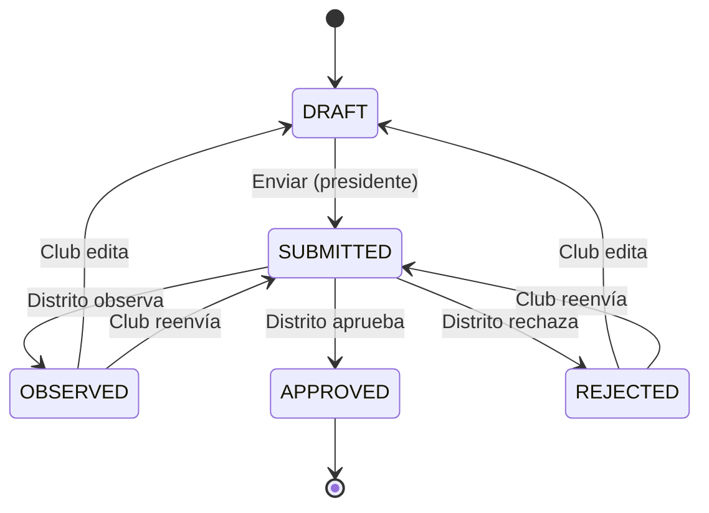
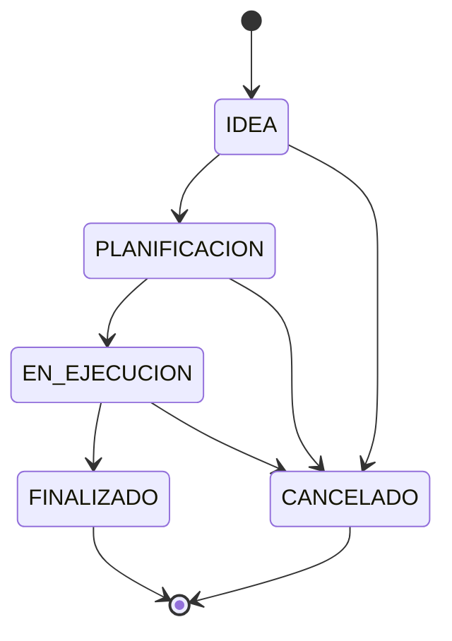

# Módulo Mi Club — Plan Funcional y Técnico

## 1. Objetivo del módulo

Centralizar la gestión institucional del club desde la perspectiva de sus autoridades: vista de identidad, informes distritales, proyectos con trazabilidad y cumplimiento. El club obtiene un espacio propio para consultar, enviar y corregir informes; gestionar proyectos; y ver indicadores básicos de cumplimiento y actividad reciente.

**Objetivo estratégico:** Convertir a cada club en un actor activo que autocustodia sus datos, cumple obligaciones informativas con el distrito y documenta sus proyectos de forma estructurada y auditable.

---

## 2. Problemas que resuelve

| Problema | Solución |
|----------|----------|
| Información del club dispersa o solo en distrito | Vista única donde el club ve y mantiene sus datos |
| Informes sin flujo claro desde el club | CRUD de informes con estados y flujo hacia distrito |
| Proyectos sin seguimiento estructurado | Proyectos con estados, avances, responsables y evidencia |
| Sin feedback distrito→club para informes | Estados OBSERVED/REJECTED con observaciones y correcciones |
| Sin trazabilidad de cambios críticos | Auditoría de ediciones de club, envíos, cambios de estado |
| Archivos de informes/proyectos sin modelo | Modelo de adjuntos con tipado (report/project) y almacenamiento controlado |

---

## 3. Roles involucrados

| Rol | Descripción | Contexto |
|-----|-------------|----------|
| **Usuario común** | Miembro del club sin cargo | Solo lectura de vista general; no informes ni proyectos |
| **Autoridad del club** | `Membership` con `title` relevante (ej. secretario, tesorero) | Crear/editar informes borrador; crear/editar proyectos según policy |
| **Presidente** | `Membership.isPresident = true` en el club | Control total: envío de informes, aprobación implícita, gestión proyectos |
| **Equipo distrital** | `User.role = SECRETARY` | Consulta y supervisión; revisa/observa/aprueba informes vía módulo Distrito |

---

## 4. Casos de uso principales

### 4.1 Vista general (consulta)

| Actor | Caso de uso | Detalle |
|-------|-------------|---------|
| Cualquier miembro del club | Ver datos del club | Nombre, logo, ciudad, zona, fecha fundación, autoridades, contacto |
| Autoridad / Presidente | Ver indicadores | informeAlDia, cuotaAldia, actividad reciente, próximos hitos |
| Presidente | Editar datos editables | Logo, descripción, datos contacto (según reglas) |

### 4.2 Informes

| Actor | Caso de uso | Detalle |
|-------|-------------|---------|
| Autoridad / Presidente | Crear informe borrador | Por período y tipo (MENSUAL|TRIMESTRAL|ANUAL) |
| Autoridad / Presidente | Editar borrador | Mientras status = DRAFT |
| Presidente | Enviar informe | DRAFT → SUBMITTED |
| Presidente / Autoridad | Ver historial y estado | SUBMITTED → OBSERVED/APPROVED/REJECTED |
| Presidente / Autoridad | Responder observaciones | Si OBSERVED/REJECTED: editar contenido, reenviar o aclarar |
| Equipo distrital | Revisar desde distrito | OBSERVED, APPROVED, REJECTED (flujo existente) |

### 4.3 Proyectos

| Actor | Caso de uso | Detalle |
|-------|-------------|---------|
| Autoridad / Presidente | Crear proyecto | IDEA → PLANIFICACION → EN_EJECUCION → FINALIZADO |
| Autoridad / Presidente | Cambiar estado | Transiciones válidas según máquina de estados |
| Autoridad / Presidente | Agregar avances | Registro con descripción, fecha, evidencia opcional |
| Presidente | Asignar responsables | Vinculación a Membership o User |
| Presidente | Cargar evidencia | Adjuntos por avance o proyecto |

---

## 5. Alcance MVP

### Vista general

- Página `/club` con datos del club (nombre, logo, ciudad, zona, fecha fundación, descripción, autoridades actuales, contacto).
- Indicadores: informeAlDia, cuotaAldia, actividad reciente (últimos informes/proyectos).
- Solo lectura salvo: presidente puede editar descripción y datos de contacto (según política de editabilidad).

### Informes

- CRUD de informes desde el club (solo club al que pertenece el usuario).
- Estados: DRAFT, SUBMITTED, OBSERVED, APPROVED, **REJECTED**.
- Flujo: crear borrador → editar borrador → enviar (solo presidente).
- Ver observaciones cuando OBSERVED/REJECTED; poder editar y reenviar (solo presidente).
- Adjuntos: modelo de archivos para informes (creación, listado; storage básico local o S3 según infra).

### Proyectos

- CRUD de proyectos con estados: IDEA, PLANIFICACION, EN_EJECUCION, FINALIZADO, CANCELADO.
- Avances (ProjectProgress) con descripción y fecha.
- Responsable asignado (userId opcional).
- Adjuntos por proyecto o por avance.

---

## 6. Alcance Fase 2

- Vista general: próximos hitos (reuniones, vencimientos de informes).
- Informes: plantillas estructuradas por tipo; respuestas a observaciones en hilo.
- Proyectos: categoría/tipo, medición de impacto básica; vista Kanban.
- Integración con Mis Socios para asignar responsables por nombre.
- Dashboard de cumplimiento por período (gráficos, tendencias).
- Exportación de proyectos e informes.
- Notificaciones cuando el distrito observa/rechaza un informe.

---

## 7. Submódulos

| Submódulo | Responsabilidad | Rutas principales |
|-----------|-----------------|-------------------|
| **club-overview** | Vista general, panel resumen, datos editables | `/club` |
| **club-reports** | Informes: CRUD, envío, historial, adjuntos | `/club/informes`, `/club/informes/[id]` |
| **club-projects** | Proyectos: CRUD, avances, adjuntos, estados | `/club/proyectos`, `/club/proyectos/[id]` |

---

## 8. Modelo de datos propuesto

### 8.1 Cambios en Club (extensión)

```prisma
model Club {
  // ... existentes ...
  logoUrl          String?   // URL o path al logo
  city             String?
  zone             String?   // zona geográfica
  foundedAt        DateTime?
  description      String?
  contactEmail     String?
  contactPhone     String?
  // Campos calculados/derivados se mantienen: cuotaAldia, informeAlDia
}
```

### 8.2 ReportStatus extendido

```prisma
enum ReportStatus {
  DRAFT
  SUBMITTED
  OBSERVED
  APPROVED
  REJECTED   // "Requiere corrección" - club debe editar y reenviar
}
```

### 8.3 Report: campos adicionales

- `responseToObservations` (String?) — respuesta del club cuando OBSERVED/REJECTED.
- `resubmittedAt` (DateTime?) — cuándo se reenvió tras corrección.

### 8.4 Nuevas entidades: Project, ProjectProgress, Attachment

```prisma
enum ProjectStatus {
  IDEA
  PLANIFICACION
  EN_EJECUCION
  FINALIZADO
  CANCELADO
}

enum ProjectCategory {
  SOCIAL
  PROFESIONAL
  AMBIENTAL
  OTRO
}

model Project {
  id          String        @id @default(cuid())
  clubId      String
  title       String
  description String?
  status      ProjectStatus @default(IDEA)
  category    ProjectCategory?
  startDate   DateTime?
  endDate     DateTime?
  assignedToId String?      // User opcional
  createdAt   DateTime     @default(now())
  updatedAt   DateTime     @updatedAt
  club        Club         @relation(...)
  assignedTo  User?        @relation(...)
  progress    ProjectProgress[]
  attachments Attachment[]
}

model ProjectProgress {
  id          String   @id @default(cuid())
  projectId   String
  description String
  progressDate DateTime
  createdAt   DateTime @default(now())
  project     Project  @relation(...)
}

model Attachment {
  id         String   @id @default(cuid())
  entityType String   // "report" | "project"
  entityId   String
  fileName   String
  mimeType   String?
  sizeBytes  Int?
  storageKey String   // path en S3/local
  uploadedById String
  uploadedAt DateTime @default(now())
  user       User     @relation(...)
  @@index([entityType, entityId])
}
```

### 8.5 Auditoría para Mi Club

- Reutilizar o extender `AuditLog` para acciones de club (report.submitted, report.resubmitted, project.status.changed, club.updated).
- Alternativa: `ClubAuditLog` con `clubId`, `action`, `entityType`, `entityId`, `actorUserId`, `metadataJson`, `createdAt`.

---

## 9. Reglas de negocio

### Club

- Solo SECRETARY crea clubs (existente).
- Presidente puede editar: logoUrl, description, contactEmail, contactPhone, city, zone. No puede editar: name, code, status, cuotaAldia, informeAlDia (distrito).
- Autoridades (según `title`) pueden editar descripción y contacto si se define policy explícita.

### Informes

- Un informe por `(clubId, districtPeriodId, type)` — constraint existente.
- Solo DRAFT puede editarse contenido; SUBMITTED en adelante el distrito controla status.
- Transiciones desde club: DRAFT → SUBMITTED (solo presidente). Desde distrito: SUBMITTED → OBSERVED | APPROVED | REJECTED.
- Si OBSERVED/REJECTED: club puede editar `contentJson`, `responseToObservations` y reenviar (DRAFT implícito o nuevo estado RESUBMITTED; se recomienda volver a SUBMITTED con `resubmittedAt`).
- Solo miembros del club (con membership activa) pueden ver informes del club.

### Proyectos

- Transiciones: IDEA → PLANIFICACION → EN_EJECUCION → FINALIZADO; cualquiera → CANCELADO.
- Solo miembros con permiso (autoridad/presidente) pueden crear/editar.
- Responsable (`assignedToId`) debe ser usuario del sistema (opcional).

### Adjuntos

- Límite de tamaño por archivo (ej. 10MB) y por entidad (ej. 5 por informe, 10 por proyecto).
- Tipos permitidos: pdf, doc, docx, xls, xlsx, jpg, png.

---

## 10. Permisos detallados por rol

| Recurso | Usuario común | Autoridad club | Presidente | Equipo distrital |
|---------|---------------|----------------|------------|------------------|
| Vista general (lectura) | ✓ (si miembro) | ✓ | ✓ | ✓ (consulta) |
| Editar datos club (logo, descripción, contacto) | ✗ | Según policy | ✓ | ✗ (Distrito usa admin clubs) |
| Ver informes del club | ✗ | ✓ | ✓ | ✓ (vía Distrito) |
| Crear/editar borrador informe | ✗ | ✓ | ✓ | ✗ |
| Enviar informe | ✗ | ✗ | ✓ | ✗ |
| Reenviar tras OBSERVED/REJECTED | ✗ | ✗ | ✓ | ✗ |
| Revisar informe (OBSERVED/APPROVED/REJECTED) | ✗ | ✗ | ✗ | ✓ |
| Ver proyectos del club | ✓ (si miembro) | ✓ | ✓ | ✓ (consulta) |
| Crear/editar proyectos | ✗ | ✓ | ✓ | ✗ |
| Eliminar proyecto (solo CANCELADO o sin avances) | ✗ | ✓ | ✓ | ✗ |
| Adjuntos (crear/listar/eliminar) | ✗ | ✓ | ✓ | ✓ (lectura) |

---

## 11. Endpoints backend sugeridos

### Club (Mi Club — contexto del usuario)

| Método | Ruta | Descripción | Guard |
|--------|------|-------------|-------|
| GET | `/club/me` | Club del usuario (por membership) | JWT, ClubMemberGuard |
| GET | `/club/me/summary` | Resumen para panel (indicadores, actividad) | JWT, ClubMemberGuard |
| PATCH | `/club/me` | Editar datos editables (logo, descripción, contacto) | JWT, ClubPresidentOrAuthorityGuard |

### Informes (desde el club)

| Método | Ruta | Descripción | Guard |
|--------|------|-------------|-------|
| GET | `/club/reports` | Lista informes del club (filtros: periodId, type, status) | JWT, ClubMemberGuard |
| GET | `/club/reports/:id` | Detalle informe | JWT, ClubMemberGuard, report pertenece al club |
| POST | `/club/reports` | Crear borrador | JWT, ClubAuthorityGuard |
| PATCH | `/club/reports/:id` | Editar borrador o responder observaciones | JWT, ClubAuthorityGuard |
| POST | `/club/reports/:id/submit` | Enviar (DRAFT → SUBMITTED) | JWT, ClubPresidentGuard |
| POST | `/club/reports/:id/resubmit` | Reenviar tras OBSERVED/REJECTED | JWT, ClubPresidentGuard |
| GET | `/club/reports/:id/attachments` | Lista adjuntos | JWT, ClubMemberGuard |
| POST | `/club/reports/:id/attachments` | Subir adjunto | JWT, ClubAuthorityGuard |
| DELETE | `/club/reports/:id/attachments/:attachmentId` | Eliminar adjunto (solo DRAFT) | JWT, ClubAuthorityGuard |

### Proyectos

| Método | Ruta | Descripción | Guard |
|--------|------|-------------|-------|
| GET | `/club/projects` | Lista proyectos del club | JWT, ClubMemberGuard |
| GET | `/club/projects/:id` | Detalle proyecto con avances y adjuntos | JWT, ClubMemberGuard |
| POST | `/club/projects` | Crear proyecto | JWT, ClubAuthorityGuard |
| PATCH | `/club/projects/:id` | Editar proyecto | JWT, ClubAuthorityGuard |
| POST | `/club/projects/:id/progress` | Agregar avance | JWT, ClubAuthorityGuard |
| PATCH | `/club/projects/:id/status` | Cambiar estado | JWT, ClubAuthorityGuard |
| POST | `/club/projects/:id/attachments` | Subir adjunto | JWT, ClubAuthorityGuard |
| DELETE | `/club/projects/:id/attachments/:attachmentId` | Eliminar adjunto | JWT, ClubAuthorityGuard |

### Attachments (genérico)

- `GET /attachments/:id/download` — descarga (validar que usuario tenga acceso al entityId/entityType).

---

## 12. Eventos WebSocket sugeridos

**Recomendación:** No usar WebSockets para Mi Club en MVP. El módulo es principalmente CRUD asíncrono y no requiere tiempo real compartido entre múltiples usuarios simultáneos.

**Fase 2 opcional:** Si se implementa notificación en vivo cuando el distrito revisa un informe: `club.report.reviewed` en una room `club:{clubId}` para que la UI actualice sin recargar.

---

## 13. Pantallas frontend sugeridas

### Rutas Next.js

```
/club                    → Vista general (panel resumen)
/club/informes           → Lista de informes
/club/informes/nuevo     → Crear informe
/club/informes/[id]      → Detalle/editar informe
/club/proyectos          → Lista de proyectos
/club/proyectos/nuevo    → Crear proyecto
/club/proyectos/[id]     → Detalle proyecto (avances, adjuntos)
```

### Componentes principales

| Componente | Uso |
|------------|-----|
| ClubOverviewCard | Tarjeta con datos del club en vista general |
| ClubIndicators | informeAlDia, cuotaAldia, actividad reciente |
| ClubAuthoritiesList | Lista autoridades (memberships con title) |
| ReportsTable | Tabla filtrable de informes |
| ReportForm | Formulario crear/editar informe |
| ReportStatusBadge | Badge según status |
| ReportAttachmentsList | Lista de adjuntos con descarga/eliminar |
| ProjectsTable | Tabla de proyectos con filtro por estado |
| ProjectForm | Crear/editar proyecto |
| ProjectProgressTimeline | Línea de avances |
| ProjectStatusSelect | Selector de estado con transiciones válidas |

---

## 14. Estados y transiciones

### Informes



### Proyectos



---

## 15. Riesgos técnicos

| Riesgo | Mitigación |
|--------|------------|
| Almacenamiento de adjuntos (coste, tamaño) | Límites por archivo y por entidad; storage en S3/local configurable; compresión de imágenes |
| Concurrencia al reenviar informe | Optimistic locking o revisión de `updatedAt` antes de actualizar |
| Permisos por "autoridad" ambiguos | Definir lista explícita de `title` que dan permiso (ej. Secretario, Tesorero) |
| Integración con Mis Socios (responsables) | MVP: asignar por userId; Fase 2: selector de socios del club |
| Sincronización cuotaAldia/informeAlDia | Distrito actualiza esos flags; club solo lectura |

---

## 16. Orden recomendado de implementación

1. **Schema y migración**: Club (nuevos campos), ReportStatus (REJECTED), Report (responseToObservations, resubmittedAt), Project, ProjectProgress, Attachment.
2. **Guards y policies**: ClubMemberGuard, ClubAuthorityGuard, ClubPresidentGuard (usan membership).
3. **Club overview**: endpoints `GET /club/me`, `GET /club/me/summary`, `PATCH /club/me`; página `/club`.
4. **Informes desde club**: CRUD, submit, resubmit; DTOs; integración con District (mantener PATCH en district/reports).
5. **Adjuntos**: servicio de storage, Attachment model, endpoints upload/download.
6. **Proyectos**: CRUD, avances, cambio de estado, adjuntos.
7. **Frontend**: pantallas informes y proyectos; formularios; filtros.
8. **Auditoría**: eventos de club para report.submitted, project.created, etc.

---

## 17. Criterios de aceptación

- [ ] Usuario con membership en un club puede ver la vista general en `/club`.
- [ ] Presidente puede editar descripción, logo, contacto del club.
- [ ] Autoridad/presidente puede crear informe borrador por período y tipo.
- [ ] Presidente puede enviar informe (DRAFT → SUBMITTED).
- [ ] Distrito puede marcar OBSERVED, APPROVED, REJECTED (ya existe; extender DTO).
- [ ] Club puede ver observaciones y reenviar tras OBSERVED/REJECTED.
- [ ] Se pueden adjuntar archivos a informes (crear, listar, eliminar en DRAFT).
- [ ] Proyectos CRUD con estados IDEA → PLANIFICACION → EN_EJECUCION → FINALIZADO.
- [ ] Avances y adjuntos en proyectos funcionan.
- [ ] Permisos por rol respetados en todos los endpoints.
- [ ] Auditoría registrada para envío y reenvío de informes y cambios críticos de proyecto.

---

## 18. Estructura sugerida de carpetas

### Backend (NestJS)

```
apps/api/src/
  club/
    club.module.ts
    club.controller.ts      # /club/me, /club/me/summary, PATCH /club/me
    club.service.ts
    guards/
      club-member.guard.ts
      club-authority.guard.ts
      club-president.guard.ts
    dto/
  club-reports/
    club-reports.module.ts
    club-reports.controller.ts   # /club/reports
    club-reports.service.ts
    dto/
  club-projects/
    club-projects.module.ts
    club-projects.controller.ts  # /club/projects
    club-projects.service.ts
    dto/
  attachments/
    attachments.module.ts
    attachments.controller.ts
    attachments.service.ts
```

### Frontend (Next.js)

```
apps/web/src/
  app/
    (club)/
      layout.tsx           # Layout para /club/*
      club/
        page.tsx           # Vista general
        informes/
          page.tsx
          nuevo/
            page.tsx
          [id]/
            page.tsx
        proyectos/
          page.tsx
          nuevo/
            page.tsx
          [id]/
            page.tsx
  components/
    club/
      ClubOverviewCard.tsx
      ClubIndicators.tsx
      ClubAuthoritiesList.tsx
      ClubEditableFields.tsx
    club/reports/
      ReportsTable.tsx
      ReportForm.tsx
      ReportStatusBadge.tsx
      ReportAttachmentsList.tsx
    club/projects/
      ProjectsTable.tsx
      ProjectForm.tsx
      ProjectProgressTimeline.tsx
      ProjectStatusSelect.tsx
```

---

## 19. Lista de tareas técnicas

### Base de datos

- [ ] Migración: campos Club (logoUrl, city, zone, foundedAt, description, contactEmail, contactPhone)
- [ ] Migración: ReportStatus + REJECTED; Report.responseToObservations, Report.resubmittedAt
- [ ] Migración: Project, ProjectProgress, Attachment; enums ProjectStatus, ProjectCategory
- [ ] Índices: Attachment(entityType, entityId), Project(clubId, status)

### Backend

- [ ] ClubMemberGuard, ClubAuthorityGuard, ClubPresidentGuard
- [ ] ClubModule: controller, service, PATCH /club/me
- [ ] ClubReportsModule: CRUD, submit, resubmit
- [ ] Extender District ReportsService/UpdateReportDto para aceptar REJECTED
- [ ] ClubProjectsModule: CRUD, progress, status
- [ ] AttachmentsModule: upload, download, delete
- [ ] Auditoría: registro de report.submitted, report.resubmitted, project.created, project.status.changed
- [ ] Tests unitarios de reglas críticas (transiciones, permisos)

### Frontend

- [ ] Layout (club) y rutas /club/*
- [ ] Página vista general con ClubOverviewCard, ClubIndicators
- [ ] Formulario edición datos club (presidente)
- [ ] Lista y detalle de informes; formulario crear/editar
- [ ] Flujo enviar/reenviar informe
- [ ] Lista y detalle de proyectos; formulario crear/editar
- [ ] Componentes de avances y adjuntos
- [ ] Estados vacíos, loaders, manejo de errores
- [ ] Integración con API (lib/api)

---

## 20. Qué dejar fuera para no romper el MVP

- Vista Kanban de proyectos
- Plantillas estructuradas de informes (MVP: contentJson libre)
- Medición de impacto de proyectos
- Notificaciones push cuando distrito revisa
- WebSockets en Mi Club
- Integración profunda con Mis Socios (asignar responsables por socios); MVP: userId directo
- Dashboard de cumplimiento con gráficos
- Exportación de informes/proyectos
- Hilo de respuestas a observaciones (MVP: campo único `responseToObservations`)

---

# Roadmap por fases

## Fase 0 — Preparación

- Extender schema Prisma (Club, Report, Project, ProjectProgress, Attachment, ReportStatus).
- Crear migración.
- Definir guards (ClubMemberGuard, ClubAuthorityGuard, ClubPresidentGuard) usando memberships.

## Fase 1 — Vista general e informes

- Endpoints club/me y club/me/summary.
- PATCH club/me para datos editables.
- Página /club (vista general).
- CRUD informes desde club; submit y resubmit.
- Extender District reports para REJECTED.
- Página /club/informes (lista y detalle).
- Adjuntos básicos para informes (storage local o S3 mínimo).

## Fase 2 — Proyectos y adjuntos

- CRUD proyectos; avances; cambio de estado.
- Adjuntos en proyectos.
- Páginas /club/proyectos (lista, detalle, formularios).
- Auditoría de acciones críticas.

## Fase 3 — Refinamiento

- Categorías de proyectos; filtros avanzados.
- Próximos hitos en vista general.
- Integración con Mis Socios para responsables.
- Exportación y notificaciones (si aplica).

---

# Backlog priorizado

### Must have

- Extensión Club (campos nuevos).
- ReportStatus REJECTED; Report.responseToObservations, resubmittedAt.
- Guards por membership (miembro, autoridad, presidente).
- CRUD informes desde club + submit + resubmit.
- CRUD proyectos + avances + estados.
- Adjuntos para informes y proyectos.
- Vista general /club.
- Pantallas informes y proyectos.
- Permisos correctos por rol.
- Auditoría de envíos y cambios críticos.

### Should have

- Resumen con actividad reciente.
- Filtros en tablas (período, tipo, estado).
- Validación de transiciones de estado.
- Límites de tamaño y cantidad de adjuntos.

### Could have

- Próximos hitos en vista general.
- Categoría de proyectos.
- Selector de responsables desde Mis Socios.
- Notificación cuando distrito revisa informe.

### Won't have por ahora

- WebSockets en Mi Club.
- Vista Kanban.
- Plantillas estructuradas de informes.
- Medición de impacto.
- Dashboard de cumplimiento con gráficos.
- Exportación avanzada.

---

# Anexos

## A. Datos del club: editables vs solo lectura

| Campo | Editable por presidente | Editable por distrito (SECRETARY) | Solo lectura |
|-------|-------------------------|-----------------------------------|--------------|
| name | ✗ | ✓ | Club |
| code | ✗ | ✓ | Club |
| status | ✗ | ✓ | Club |
| logoUrl | ✓ | ✓ | |
| city | ✓ | ✓ | |
| zone | ✓ | ✓ | |
| foundedAt | ✓ | ✓ | |
| description | ✓ | ✓ | |
| contactEmail | ✓ | ✓ | |
| contactPhone | ✓ | ✓ | |
| presidentEmail | ✗ | ✓ | Club |
| enabledForDistrictMeetings | ✗ | ✓ | Club |
| cuotaAldia | ✗ | ✓ | Club |
| informeAlDia | ✗ | ✓ | Club |

## B. Diseño del panel de resumen del club

El panel en `/club` debe mostrar en orden de prioridad:

1. **Header**: Logo, nombre, código, ciudad/zona.
2. **Indicadores de cumplimiento**: badges para informeAlDia, cuotaAldia (colores: verde=al día, rojo=pendiente).
3. **Autoridades actuales**: lista de memberships con `activeUntil = null` o futura, ordenadas por isPresident primero, luego por title.
4. **Datos de contacto**: email, teléfono (si existen).
5. **Descripción institucional**: texto corto (truncado si es largo, con "ver más").
6. **Actividad reciente**: últimas 5 acciones (informes enviados, proyectos actualizados) con fecha y tipo.
7. **Acciones rápidas**: enlaces a "Informes", "Proyectos" (si tiene permiso).

## C. Auditoría de cambios importantes

Acciones a auditar (en `AuditLog` o `ClubAuditLog`):

| Acción | entityType | entityId | metadataJson |
|--------|------------|----------|--------------|
| club.updated | Club | clubId | { fields: string[] } |
| report.created | Report | reportId | { periodId, type } |
| report.submitted | Report | reportId | { periodId, type } |
| report.resubmitted | Report | reportId | { periodId, type } |
| project.created | Project | projectId | { title } |
| project.status.changed | Project | projectId | { from, to } |
| attachment.uploaded | Attachment | attachmentId | { entityType, entityId } |

El actor (`actorUserId`) debe ser el usuario autenticado que ejecuta la acción.

## D. Estructura de archivos y adjuntos

- **Storage**: path `{entityType}/{entityId}/{attachmentId}.{ext}` en S3 o sistema de archivos.
- **Attachment** guarda: `storageKey` (path completo), `fileName` (nombre original), `mimeType`, `sizeBytes`.
- **Límites MVP**: 5 archivos por informe, 10 por proyecto; 10MB por archivo.
- **Tipos permitidos**: pdf, doc, docx, xls, xlsx, jpg, jpeg, png.
- **Eliminación**: soft delete opcional o borrado físico; si se elimina informe/proyecto, cascade de adjuntos.
