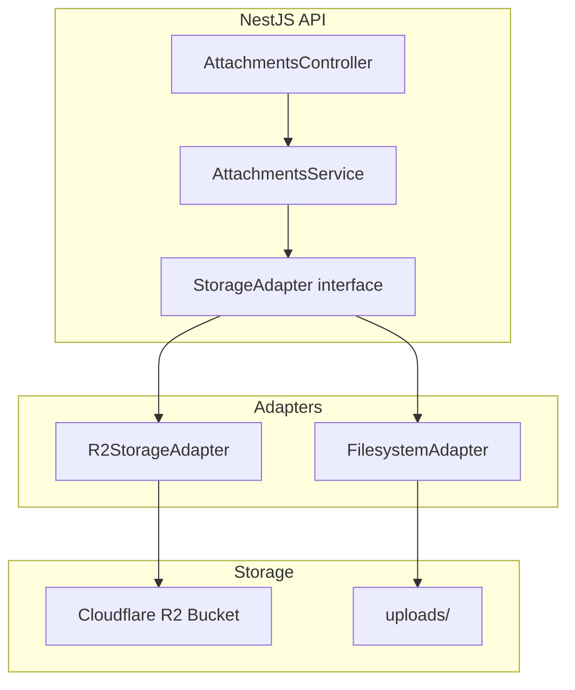
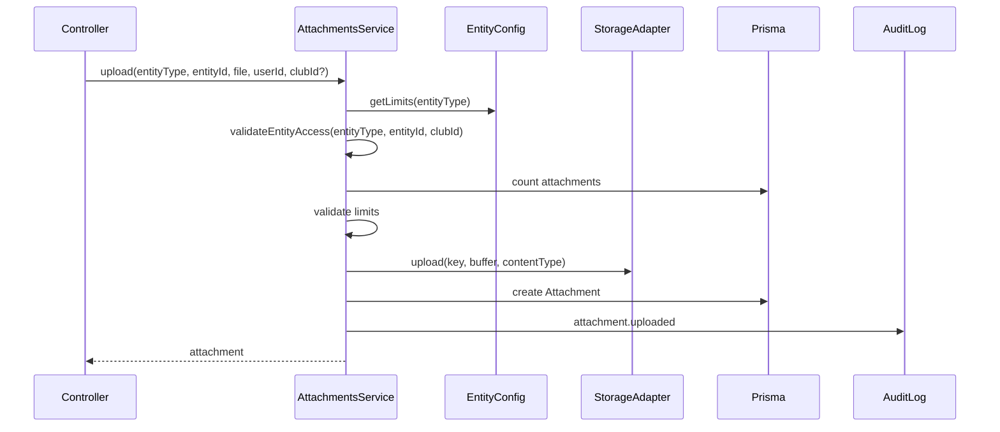
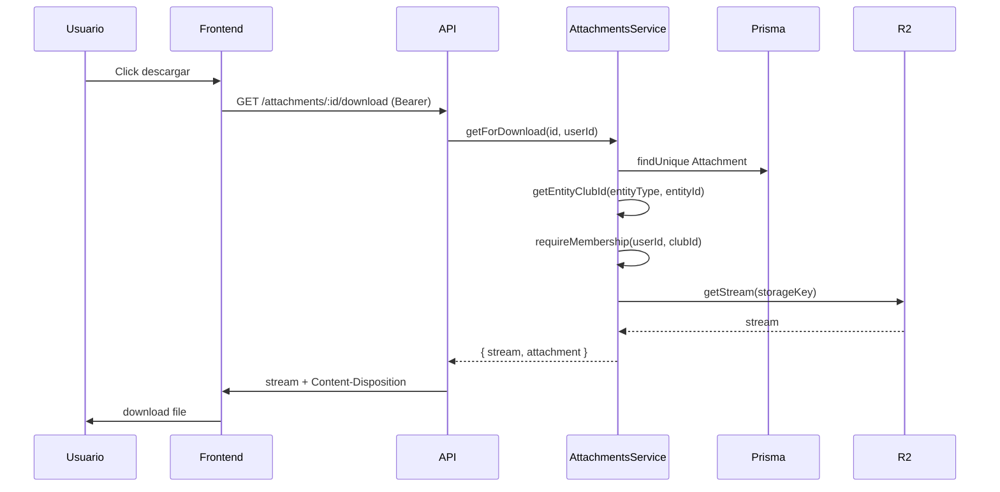

# Plan del Módulo "Archivos / Adjuntos / Evidencias"

## Resumen ejecutivo

Módulo centralizado de adjuntos que reemplaza el almacenamiento en filesystem por **Cloudflare R2**, manteniendo la tabla genérica `Attachment` y la API existente, con extensibilidad para Eventos, Comités, Reuniones y futuras evidencias institucionales.

---

## 1. Objetivo y visión del módulo

**Objetivo:** Proporcionar un servicio de adjuntos unificado, escalable y auditable para toda la plataforma, usando Cloudflare R2 como almacenamiento principal.

**Visión:**
- Un único servicio de adjuntos consumido por múltiples módulos.
- Reglas de negocio y límites configurables por tipo de entidad.
- Auditoría completa de subida y eliminación.
- Migración transparente desde filesystem a R2 sin romper consumidores existentes.
- Preparado para futuras entidades (eventos, comités, reuniones, evidencias institucionales).

---

## 2. Casos de uso principales

| Caso de uso | Actor | Descripción |
|-------------|-------|-------------|
| Adjuntar evidencia a informe | Presidente/Secretaría club | Sube PDF/Excel/Word/imagen como evidencia del informe mensual/trimestral. |
| Adjuntar evidencia a proyecto | Miembro con autoridad | Sube fotos/documentos como evidencia del avance del proyecto. |
| Descargar adjunto | Miembro del club | Descarga un adjunto asociado a un informe o proyecto de su club. |
| Eliminar adjunto | Presidente/Secretaría | Elimina adjunto de informe (solo DRAFT) o de proyecto. |
| Listar adjuntos | Miembro con autoridad | Lista adjuntos de un informe o proyecto. |
| Adjuntar a evento (F2) | Organizador | Sube imagen de portada o documentos del evento. |
| Adjuntar a comité (F2) | Coordinador | Sube evidencias de actividad del comité. |
| Adjuntar a reunión (F2) | Secretaría | Adjunta acta o documentos de la reunión. |

---

## 3. Alcance MVP vs Fase 2

### MVP (Fase 1)

| Incluido | Detalle |
|----------|---------|
| Migrar a R2 | Reemplazar filesystem por Cloudflare R2 |
| Mantener consumidores actuales | Informes y Proyectos sin cambios funcionales |
| Tabla genérica | `Attachment` con `entityType` + `entityId` |
| Auditoría | Upload y delete registrados en `AuditLog` |
| Config por entityType | Límites (max archivos, max size, MIME) configurables |
| URL pública opcional | Para R2 con dominio custom (opcional MVP) |

### Fase 2

| Incluido | Detalle |
|----------|---------|
| Eventos | Adjuntar imagen de portada, documentos |
| Comités | Adjuntar evidencias a `CommitteeActivity` |
| Reuniones | Adjuntar actas, documentos de reunión |
| Alcance distrital | Entidades sin clubId (evento distrital, comité) |
| Preview/thumbnail | Para imágenes (opcional) |
| Presigned URLs | Descarga sin pasar por API para archivos grandes |

---

## 4. Modelo de datos propuesto

### 4.1 Decisión: tabla genérica vs tablas específicas

**Recomendación: tabla genérica.**

| Criterio | Genérica | Específicas |
|----------|----------|-------------|
| Nuevas entidades | Sin migración | Migración + nueva tabla por entidad |
| Lógica compartida | Un solo servicio | Duplicación o herencia compleja |
| Consultas | Filtro por entityType/entityId | Joins naturales |
| Auditoría | Unificado | Dispersa |

El modelo actual ya es genérico; se mantiene y se extiende con `storageBackend` y `scope` para futura migración.

### 4.2 Schema Prisma (evolución)

```prisma
model Attachment {
  id            String   @id @default(cuid())
  entityType    String   // "report" | "project" | "event" | "committee_activity" | "meeting"
  entityId      String
  fileName      String
  mimeType      String?
  sizeBytes     Int?
  storageKey    String   // R2: "entityType/entityId/uuid.ext" — no incluir path local
  storageBackend String  @default("r2")  // "r2" | "fs" (para migración)
  uploadedById  String
  uploadedAt    DateTime @default(now())
  user          User     @relation(fields: [uploadedById], references: [id], onDelete: Cascade)
  @@index([entityType, entityId])
  @@index([uploadedById])
}
```

**Cambios respecto al actual:**
- `storageBackend`: permite coexistencia durante migración (default `r2` para nuevos).
- No se agrega `clubId` denormalizado: la visibilidad se resuelve vía entidad (report → club, project → club, etc.).

---

## 5. Estrategia de almacenamiento (R2)

### 5.1 Arquitectura



### 5.2 Interfaz de almacenamiento

```typescript
interface StorageAdapter {
  upload(params: { key: string; body: Buffer; contentType: string }): Promise<void>;
  delete(key: string): Promise<void>;
  getStream(key: string): Promise<Readable>;
  getPublicUrl?(key: string): string | null;  // opcional, si R2 tiene dominio público
}
```

### 5.3 Configuración R2

| Variable | Uso |
|----------|-----|
| `R2_ACCOUNT_ID` | Para endpoint |
| `R2_ACCESS_KEY_ID` | Credenciales |
| `R2_SECRET_ACCESS_KEY` | Credenciales |
| `R2_BUCKET_NAME` | Bucket de adjuntos |
| `R2_PUBLIC_BASE_URL` | Base URL si el bucket es público (opcional) |
| `STORAGE_ADAPTER` | `r2` \| `fs` (para migración/fallback) |

### 5.4 Convención de `storageKey`

```
{entityType}/{entityId}/{uuid}{ext}
```

Ejemplos:
- `report/abc123/uuid-1.pdf`
- `project/xyz789/uuid-2.jpg`

Sin prefijo de fecha ni ambiente: el bucket puede ser por ambiente (dev/staging/prod).

---

## 6. Reglas de negocio

### 6.1 Por entityType

| entityType | Max archivos | Max size | MIME permitidos | Edición/eliminación |
|------------|--------------|----------|-----------------|---------------------|
| report | 5 | 10MB | PDF, DOC, DOCX, XLS, XLSX, JPEG, PNG | Solo si status = DRAFT |
| project | 10 | 10MB | Idem | Siempre (mientras proyecto editable) |
| event | 5 | 5MB | JPEG, PNG, PDF | Solo si status = DRAFT |
| committee_activity | 5 | 10MB | Idem report | Según política comité |
| meeting | 10 | 10MB | PDF, DOC, DOCX, XLS, XLSX, JPEG, PNG | Solo si status = DRAFT |

### 6.2 Validación

- Validar MIME real (magic bytes) además de `Content-Type` si es crítico para seguridad.
- Sanitizar `fileName`: quitar caracteres peligrosos, limitar longitud.
- Rechazar extensiones ejecutables (.exe, .bat, .sh, etc.) por blacklist.

### 6.3 Eliminación

- Report: solo DRAFT.
- Project: siempre (mientras usuario tenga permiso).
- Delete en storage debe ser idempotente (no fallar si el objeto no existe en R2).

---

## 7. Permisos por rol y recurso

### 7.1 Ownership y visibilidad

**Resolución de scope:**

| entityType | Scope | Cómo obtener |
|------------|-------|--------------|
| report | clubId | Report.clubId |
| project | clubId | Project.clubId |
| event | clubId o district | Event.clubId (null = distrital) |
| committee_activity | district | Committee → districtPeriod |
| meeting | clubId | Meeting.clubId |

Para MVP solo `report` y `project` (ambos club-scoped).

### 7.2 Matriz de permisos (MVP)

| Acción | Quién puede |
|--------|-------------|
| Listar adjuntos | Miembro del club con autoridad (ClubAuthorityGuard) |
| Subir | Idem |
| Descargar | Miembro del club (ClubMemberGuard + membership en club del entity) |
| Eliminar | Idem listar/subir, más regla de estado (report DRAFT) |

El `AttachmentsController` para descarga no usa `ClubMemberGuard` a nivel de club del recurso; el guard actual solo garantiza que el usuario pertenezca a algún club. La autorización real está en `AttachmentsService.getForDownload`, que resuelve el club de la entidad y valida membership. **Recomendación:** mantener esa lógica en el servicio; el guard puede quedarse como está o crearse un guard específico que resuelva el attachment y valide acceso.

### 7.3 Fase 2: alcance distrital

Para `event` (clubId null) o `committee_activity`: verificar rol SECRETARIAT o membership en comité/organizador del evento.

---

## 8. Diseño backend NestJS

### 8.1 Estructura de módulos

```
attachments/
├── attachments.module.ts
├── attachments.controller.ts      # GET /attachments/:id/download
├── attachments.service.ts         # Orquestación, validación, auditoría
├── storage/
│   ├── storage.module.ts
│   ├── storage.interface.ts
│   ├── r2.storage.ts              # R2StorageAdapter
│   └── filesystem.storage.ts      # FilesystemAdapter (legacy/migración)
├── config/
│   └── attachment-entity.config.ts  # Límites por entityType
└── dto/
    └── (si se agregan DTOs explícitos)
```

### 8.2 Flujo de servicios



### 8.3 Política de inyección del StorageAdapter

- `StorageModule` exporta `StorageAdapter` (token).
- Según `STORAGE_ADAPTER`, se registra `R2StorageAdapter` o `FilesystemStorageAdapter`.
- `AttachmentsService` recibe `StorageAdapter` por DI.

### 8.4 Extensión para nuevos entityTypes

Registry en `attachment-entity.config.ts`:

```typescript
const ENTITY_CONFIG: Record<string, EntityAttachmentConfig> = {
  report: { maxFiles: 5, maxSizeBytes: 10 * 1024 * 1024, allowedMimes: [...], canDelete: (entity) => entity.status === 'DRAFT' },
  project: { maxFiles: 10, maxSizeBytes: 10 * 1024 * 1024, allowedMimes: [...], canDelete: () => true },
  // event, committee_activity, meeting en F2
};
```

Cada consumidor sigue exponiendo sus rutas (`:id/attachments`) y delega en `AttachmentsService.upload/delete/list`.

---

## 9. Diseño frontend Next.js

### 9.1 Reutilización actual

- `ReportAttachmentsList` y `ProjectAttachmentsList` son muy similares.
- Diferentes solo en: `maxFiles`, `reportId` vs `projectId`, endpoints.

### 9.2 Componente genérico sugerido

```
components/
  attachments/
    AttachmentsCard.tsx      # Card con lista + upload + delete
    useAttachments.ts        # Hook: list, upload, delete, download
```

Props: `entityType`, `entityId`, `maxFiles`, `onChange?`.  
El hook usa `clubApi.reports.*` o `clubApi.projects.*` según `entityType`, o una API unificada si se introduce:

```
GET  /attachments?entityType=report&entityId=...
POST /attachments (multipart, entityType + entityId en body)
DELETE /attachments/:id
```

**MVP:** mantener rutas anidadas (`club/reports/:id/attachments`) para no romper contratos. El componente genérico puede recibir funciones `list`, `upload`, `delete` como props para reutilizar la UI sin tocar la API.

### 9.3 Pantallas afectadas

| Pantalla | Cambios MVP |
|----------|-------------|
| Informe detalle | Ninguno (usa ReportAttachmentsList) |
| Proyecto detalle | Ninguno (usa ProjectAttachmentsList) |

Fase 2: Evento detalle, Actividad de comité, Reunión detalle.

---

## 10. WebSockets

**No aplicar para adjuntos en MVP ni Fase 2.**

Los adjuntos no requieren sincronización en tiempo real entre usuarios. La lista se actualiza tras subir/eliminar con un refetch. Si en el futuro se quisiera notificar "nuevo adjunto" en una vista compartida, podría evaluarse; no es prioritario.

---

## 11. Endpoints sugeridos

### Actuales (mantener)

| Método | Ruta | Responsable | Descripción |
|--------|------|-------------|-------------|
| GET | `/club/reports/:id/attachments` | ClubReportsController | Lista adjuntos del informe |
| POST | `/club/reports/:id/attachments` | ClubReportsController | Sube adjunto |
| DELETE | `/club/reports/:id/attachments/:attachmentId` | ClubReportsController | Elimina adjunto |
| GET | `/club/projects/:id/attachments` | ClubProjectsController | Lista adjuntos del proyecto |
| POST | `/club/projects/:id/attachments` | ClubProjectsController | Sube adjunto |
| DELETE | `/club/projects/:id/attachments/:attachmentId` | ClubProjectsController | Elimina adjunto |
| GET | `/attachments/:id/download` | AttachmentsController | Descarga (stream) |

### Opcional Fase 2: API unificada

```
GET  /attachments?entityType=report&entityId=...
POST /attachments (multipart)
DELETE /attachments/:id
```

Solo si se quiere desacoplar el frontend de rutas por recurso. No necesario para MVP.

---

## 12. Integración con otros módulos

| Módulo | Integración |
|--------|-------------|
| Mi Club > Informes | Ya integrado. Sin cambios de API. |
| Mi Club > Proyectos | Ya integrado. Sin cambios de API. |
| Distrito > Comités | F2: CommitteeActivity tendrá attachments |
| Eventos | F2: Event tendrá attachments (imagen, docs) |
| Reuniones Distritales | F2: Meeting podría tener actas/documentos |
| Auth/Roles | Guards existentes; F2 agregar lógica distrital |

---

## 13. Riesgos técnicos y de seguridad

### 13.1 Técnicos

| Riesgo | Mitigación |
|--------|------------|
| R2 no disponible | Fallback a filesystem vía `STORAGE_ADAPTER` |
| Archivos corruptos en migración | Script de migración con validación; no borrar FS hasta validar |
| Latencia R2 | Streaming en lugar de buffer completo; timeouts razonables |
| Límite de tasa R2 | Implementar rate limit en upload si hace falta |

### 13.2 Seguridad

| Riesgo | Mitigación |
|--------|------------|
| Path traversal en storageKey | Generar key en servidor, no confiar en cliente |
| MIME spoofing | Validar magic bytes además de Content-Type |
| Acceso no autorizado | Siempre validar membership/rol antes de download |
| Archivos maliciosos | Límites de tipo; no ejecutar archivos; sandbox si hay procesamiento futuro |
| Exposición de URLs | Evitar URLs públicas pre-firmadas con larga expiración; preferir download vía API |

---

## 14. Estrategia de nombres, rutas y metadatos

### 14.1 storageKey

- Formato: `{entityType}/{entityId}/{uuid}{ext}`
- `ext` derivado de `fileName` (sanitizado) o del MIME.
- Sin información sensible en el key.

### 14.2 fileName en BD

- Guardar el nombre original para mostrar al usuario.
- Sanitizado: reemplazar caracteres no seguros, limitar longitud (ej. 255).

### 14.3 Metadatos en R2 (opcional)

- `Content-Type` al subir.
- Opcional: `x-amz-meta-entity-type`, `x-amz-meta-entity-id` para debugging.

---

## 15. Estrategia de auditoría

### 15.1 Eventos a auditar

| Acción | AuditLog |
|--------|----------|
| attachment.uploaded | clubId, actorUserId, entityType, entityId, attachmentId |
| attachment.deleted | Idem |

`AuditLog` actual tiene `clubId` y `meetingId` opcionales. Para adjuntos de informes/proyectos se usa `clubId`. Para entidades distritales (F2) podría agregarse `districtPeriodId` o similar si el modelo lo requiere.

### 15.2 Trazabilidad

- `uploadedById` y `uploadedAt` en `Attachment`.
- No almacenar el archivo en sí en el log; solo metadatos.

---

## 16. Migración desde filesystem a R2

### 16.1 Enfoque

1. **Fase 0:** Implementar `R2StorageAdapter` y `StorageModule` con toggle por env.
2. **Nuevos adjuntos:** Usar R2 por defecto.
3. **Legacy:** Mantener lectura desde filesystem para `storageBackend = 'fs'` (o key con prefijo `fs/`).
4. **Script de migración:**
   - Listar attachments con `storageBackend = 'fs'` o sin el campo (legacy).
   - Para cada uno: leer desde FS → subir a R2 con mismo `storageKey` → actualizar `storageBackend = 'r2'`.
   - Errores: log + continuar; revisar manualmente.
5. **Post-migración:** Cambiar default a R2; eliminar archivos locales en disco cuando se confirme que no hay referencias a `fs`.

### 16.2 Compatibilidad

- Si un attachment tiene `storageKey` con path antiguo (`report/xxx/file.pdf`), el adapter de FS lo resolvería como `uploadDir/report/xxx/file.pdf`.
- En R2 el mismo key sería `report/xxx/file.pdf` (sin `uploadDir`). El `R2StorageAdapter` no usa `uploadDir`.

---

## 17. Orden recomendado de implementación

| Orden | Tarea |
|-------|-------|
| 1 | Crear `StorageAdapter` interface y `R2StorageAdapter` |
| 2 | Crear `StorageModule` con provider dinámico |
| 3 | Refactorizar `AttachmentsService` para usar `StorageAdapter` |
| 4 | Agregar `storageBackend` al schema (migración) |
| 5 | Mover config de límites a `attachment-entity.config.ts` |
| 6 | Configurar variables R2 en env |
| 7 | Probar upload/download/delete con R2 |
| 8 | Script de migración FS → R2 (opcional, si hay datos) |
| 9 | Documentar y validar criterios de aceptación |

---

## 18. Backlog priorizado

### Must have (MVP)

- [ ] `StorageAdapter` + `R2StorageAdapter` con cliente S3 compatible R2
- [ ] `AttachmentsService` usa adapter inyectado
- [ ] Variables de entorno R2
- [ ] Config de límites por entityType en módulo central
- [ ] Probar flujo completo (report + project) con R2

### Should have

- [ ] Migración de datos existentes (FS → R2)
- [ ] Fallback a FS si R2 falla (configurable)
- [ ] Componente genérico `AttachmentsCard` para reducir duplicación frontend

### Could have

- [ ] Validación por magic bytes
- [ ] Presigned URLs para descarga directa (archivos grandes)

### Won't have por ahora

- [ ] WebSockets para adjuntos
- [ ] Thumbnails / preview de imágenes
- [ ] Soporte Event/Committee/Meeting (Fase 2)

---

## 19. Criterios de aceptación

1. Los adjuntos de informes y proyectos se almacenan en R2.
2. Upload, list, download y delete funcionan igual que antes para el usuario.
3. Límites (5 informes, 10 proyectos, 10MB, MIME) se respetan.
4. Solo se pueden eliminar adjuntos de informes en estado DRAFT.
5. Cada upload y delete queda registrado en AuditLog.
6. La aplicación funciona con `STORAGE_ADAPTER=r2` en producción.
7. Existe documentación de variables de entorno y convención de storageKey.

---

## 20. Qué dejar fuera para no romper el MVP

- Eventos, Comités, Reuniones como consumidores (Fase 2).
- Alcance distrital (F2).
- URLs públicas de R2 para acceso sin autenticación (por ahora descarga vía API).
- Cambios en la estructura de endpoints (mantener anidados).
- WebSockets.
- Preview/thumbnails.
- Validación por magic bytes (aceptar Content-Type por ahora, documentar riesgo).

---

# Roadmap por fases

## Fase 0: Preparación

- Definir `StorageAdapter` e integrar cliente R2.
- Configuración de env para desarrollo.

## Fase 1: MVP R2

- Implementar `R2StorageAdapter`.
- Refactor de `AttachmentsService`.
- Migración de schema (storageBackend).
- Config central de entityTypes.
- Pruebas E2E de flujo actual.

## Fase 2: Extensión

- Eventos con adjuntos.
- Comités con adjuntos.
- Reuniones con actas.
- Alcance distrital (guards y políticas).

## Fase 3: Mejoras

- Componente genérico frontend.
- Validación por magic bytes.
- Presigned URLs (si aplica).

---

# Diagrama de flujo de descarga



---

# Resumen de decisiones explícitas

| Pregunta | Decisión |
|----------|----------|
| Tabla genérica vs específica | **Genérica** |
| Tamaño/tipo por entityType | **Registry config** centralizado |
| Ownership/visibilidad | **Resolver vía entidad** (getEntityClubId / futuro getEntityScope) |
| Migración FS → R2 | **Adapter + storageBackend**, script de migración por lotes |
| Evitar duplicación | **AttachmentsService único**, config por entityType, componentes UI reutilizables |
