## Módulo de reuniones (meetings)

### 1. Introducción

El módulo de reuniones (`meetings`) digitaliza las reuniones distritales de presidentes de clubes Rotaract. Su objetivo es:

- **Administrar reuniones distritales** (creación, programación, estados).
- **Mostrar el estado de la reunión en tiempo real** a todos los participantes.
- **Habilitar votaciones digitales auditables**.
- **Gestionar la cola de oradores y los tiempos de palabra**.
- **Registrar acciones relevantes con trazabilidad**.

Se apoya en:

- **Backend** NestJS (`apps/api/src/meetings`, `apps/api/src/realtime`, Prisma `Meeting` y entidades relacionadas).
- **Frontend** Next.js (`apps/web/src/app/meetings` y vistas admin bajo `/admin/meetings`).
- **Persistencia** con Prisma + PostgreSQL.
- **WebSockets** (Socket.IO) para sincronización en vivo.

El alcance de este módulo se alinea con el MVP definido en las reglas del proyecto:

- Incluye: login seguro, acceso a reuniones asignadas, agenda, cola de oradores, votaciones Sí/No/Abstención, timers y trazabilidad.
- No incluye: videollamada integrada, streaming propio ni módulos administrativos avanzados (actas completas, métricas distritales, etc.).

---

### 2. Modelo de dominio y entidades

El dominio de reuniones gira alrededor de la entidad `Meeting` y sus relaciones principales:

- `Meeting`: reunión distrital; define título, club anfitrión, fechas y estado.
- `AgendaTopic`: temas de agenda ordenados dentro de una reunión.
- `MeetingParticipant`: relación reunión–usuario con permisos de voto y estado de asistencia.
- `VoteSession`: instancia de votación asociada a un tema.
- `Vote`: voto individual de un participante en una sesión.
- `SpeakingRequest`: solicitudes de palabra y cola de oradores.
- `TimerSession`: mediciones de tiempo ligadas a temas u oradores.
- `AuditLog`: registro de acciones críticas relacionadas con una reunión.

#### 2.1 Entidades principales (resumen)

- **Meeting**
  - Identifica una reunión de distrito.
  - Campos clave: `id`, `title`, `description`, `scheduledAt`, `startedAt`, `endedAt`, `status`, `currentTopicId`, `currentSpeakerId`, `nextSpeakerId`, `clubId`, `createdById`.
  - Relaciones: `participants`, `topics`, `voteSessions`, `speakingRequests`, `timerSessions`, `auditLogs`.

- **AgendaTopic**
  - Tema de la agenda de una reunión.
  - Campos clave: `id`, `meetingId`, `title`, `description`, `order`, `type`, `estimatedDurationSec`, `status`.
  - Relación: pertenece a un `Meeting` y puede tener varias `VoteSession`.

- **MeetingParticipant**
  - Un usuario convocado/participante en una reunión.
  - Campos clave: `id`, `meetingId`, `userId`, `canVote`, `attendanceStatus`, `joinedAt`.
  - Relación: une `User` con `Meeting`.

- **VoteSession**
  - Una instancia de votación sobre un tema dentro de una reunión.
  - Campos clave: `id`, `meetingId`, `topicId`, `status`, `openedAt`, `closedAt`, `openedById`, `closedById`.
  - Relaciones: pertenece a un `Meeting` y a un `AgendaTopic`; contiene muchos `Vote`.

- **Vote**
  - Voto individual emitido por un usuario en una sesión.
  - Campos clave: `id`, `voteSessionId`, `userId`, `choice`, `createdAt`.
  - Restricción crítica: `@@unique([voteSessionId, userId])` (un voto por sesión y usuario).

- **SpeakingRequest**
  - Solicitud de palabra en una reunión.
  - Campos clave: `id`, `meetingId`, `userId`, `status`, `position`, `requestedAt`, `acceptedAt`.
  - La `position` define el orden en la cola de oradores.

- **TimerSession**
  - Timer que mide el tiempo de un tema o un orador.
  - Campos clave: `id`, `meetingId`, `topicId`, `speakingRequestId`, `type`, `plannedDurationSec`, `startedAt`, `pausedAt`, `endedAt`, `overtimeSec`.

- **AuditLog**
  - Registro de acciones relevantes sobre reuniones y clubes.
  - Campos clave: `id`, `meetingId`, `clubId`, `actorUserId`, `action`, `entityType`, `entityId`, `metadataJson`, `createdAt`.

#### 2.2 Enums relevantes

- `MeetingStatus`: `DRAFT | SCHEDULED | LIVE | PAUSED | FINISHED | ARCHIVED`.
- `TopicType`: `DISCUSSION | VOTING | INFORMATIVE`.
- `TopicStatus`: `PENDING | ACTIVE | DONE`.
- `VoteSessionStatus`: `OPEN | CLOSED`.
- `VoteChoice`: `YES | NO | ABSTAIN`.
- `AttendanceStatus`: `INVITED | JOINED | LEFT`.
- `SpeakingRequestStatus`: `PENDING | ACCEPTED | CANCELLED | DONE`.

#### 2.3 Diagrama entidad–relación (ER)

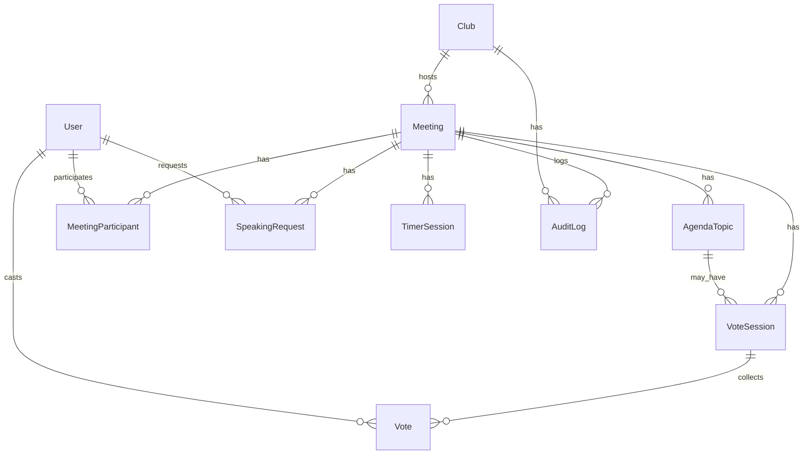

---

### 3. API REST del módulo meetings

El backend expone un conjunto de controladores NestJS que agrupan la funcionalidad del dominio de reuniones:

- `MeetingsController` (`/meetings`): creación, listado, detalle, cambios de estado, participantes, adjuntos, importación masiva.
- `TopicsController` (`/meetings/:meetingId/topics`): gestión de agenda y tema actual.
- `SpeakingQueueController` (`/meetings/:meetingId/queue`): cola de oradores.
- `VotingController` (`/meetings/:meetingId/vote*`): sesiones de votación y resultados.
- `TimersController` (`/meetings/:meetingId/timers`): timers de temas/oradores.

#### 3.1 Endpoints principales (resumen)

**Reuniones (`/meetings`)**

- `POST /meetings` (SECRETARY, PRESIDENT)
  - Crea una reunión en estado `DRAFT`.
  - Body: `CreateMeetingDto { title, description?, scheduledAt?, clubId }`.
- `GET /meetings`
  - Lista reuniones según rol:
    - SECRETARY/PRESIDENT: todas.
    - Otros roles: donde es `MeetingParticipant` o reuniones no `DRAFT`.
- `GET /meetings/:id`
  - Devuelve detalle de una reunión (incluye club y participantes).
  - Control de acceso: SECRETARY/PRESIDENT o participante; si no, se responde `404`.
- `PATCH /meetings/:id` (SECRETARY, PRESIDENT)
  - Actualiza título, descripción y fecha programada.
- `POST /meetings/:id/schedule` (SECRETARY, PRESIDENT)
  - Cambia una reunión `DRAFT` a `SCHEDULED`.
- `POST /meetings/:id/start` (SECRETARY, PRESIDENT)
  - Cambia `DRAFT`/`SCHEDULED` a `LIVE` y setea `startedAt`.
- `POST /meetings/:id/pause` (SECRETARY, PRESIDENT)
  - Cambia `LIVE` a `PAUSED`.
- `POST /meetings/:id/resume` (SECRETARY, PRESIDENT)
  - Cambia `PAUSED` a `LIVE`.
- `POST /meetings/:id/finish` (SECRETARY, PRESIDENT)
  - Cambia `LIVE`/`PAUSED` a `FINISHED` y setea `endedAt`.

**Participantes**

- `POST /meetings/:id/participants` (SECRETARY, PRESIDENT)
  - Reemplaza la lista de participantes de la reunión.
  - Body: `AssignParticipantsDto { participants: { userId, canVote? }[] }`.
- `GET /meetings/:id/participants/bulk/template` (SECRETARY)
  - Devuelve plantilla CSV para cargar participantes.
- `POST /meetings/:id/participants/bulk` (SECRETARY)
  - Importa participantes desde CSV.

**Adjuntos**

- `GET /meetings/:id/attachments` (SECRETARY, PRESIDENT)
  - Lista adjuntos asociados a la reunión.
- `POST /meetings/:id/attachments` (SECRETARY, PRESIDENT)
  - Sube un archivo y lo vincula a la reunión.
- `DELETE /meetings/:id/attachments/:attachmentId` (SECRETARY, PRESIDENT)
  - Elimina un adjunto.

**Agenda / temas (`/meetings/:meetingId/topics`)**

- `GET /meetings/:meetingId/topics`
  - Devuelve los temas de la reunión (ordenados por `order`).
- `POST /meetings/:meetingId/topics` (SECRETARY, PRESIDENT)
  - Crea un nuevo tema.
  - Body: `CreateTopicDto { title, description?, order?, type?, estimatedDurationSec? }`.
- `PATCH /meetings/:meetingId/topics/:topicId` (SECRETARY, PRESIDENT)
  - Actualiza los campos de un tema (`UpdateTopicDto`).
- `DELETE /meetings/:meetingId/topics/:topicId` (SECRETARY, PRESIDENT)
  - Elimina un tema; si era el actual, limpia `currentTopicId`.
- `POST /meetings/:meetingId/topics/reorder` (SECRETARY, PRESIDENT)
  - Reasigna el orden de los temas según un array de IDs.
- `POST /meetings/:meetingId/topics/current` (SECRETARY, PRESIDENT)
  - Cambia el tema actual de la reunión (sólo en `LIVE`/`PAUSED`).

**Cola de oradores (`/meetings/:meetingId/queue`)**

- `GET /meetings/:meetingId/queue`
  - Recupera la cola de solicitudes de palabra.
- `GET /meetings/:meetingId/queue/state`
  - Devuelve cola + orador actual y siguiente.
- `POST /meetings/:meetingId/queue/request`
  - Participante solicita palabra.
- `POST /meetings/:meetingId/queue/cancel`
  - Participante cancela su propia solicitud (si está pendiente).
- `POST /meetings/:meetingId/queue/current-speaker` (SECRETARY, PRESIDENT)
  - Fija el orador actual.
- `POST /meetings/:meetingId/queue/next-speaker` (SECRETARY, PRESIDENT)
  - Fija el siguiente orador.

**Votaciones (`/meetings/:meetingId/vote*`)**

- `POST /meetings/:meetingId/vote/open` (SECRETARY, PRESIDENT)
  - Abre una sesión de votación para un tema.
- `POST /meetings/:meetingId/vote/close` (SECRETARY, PRESIDENT)
  - Cierra una sesión de votación y calcula resultados.
- `POST /meetings/:meetingId/vote`
  - Emite un voto (`choice: YES | NO | ABSTAIN`) para una sesión abierta.
- `GET /meetings/:meetingId/vote/current`
  - Devuelve la sesión de votación abierta actual (si existe).
- `GET /meetings/:meetingId/vote/:voteSessionId/result`
  - Devuelve el resultado agregado.
- `GET /meetings/:meetingId/vote/:voteSessionId/detailed` (SECRETARY, PRESIDENT)
  - Devuelve resultado detallado con lista nominal de votos.

**Timers (`/meetings/:meetingId/timers`)**

- `GET /meetings/:meetingId/timers/active`
  - Devuelve el timer activo más reciente (si existe).
- `POST /meetings/:meetingId/timers/topic/start` (SECRETARY, PRESIDENT)
  - Inicia un timer para un tema concreto.
- `POST /meetings/:meetingId/timers/stop` (SECRETARY, PRESIDENT)
  - Detiene un timer y calcula overtime.

---

### 4. WebSockets y sincronización en tiempo real

El módulo usa un `RealtimeGateway` basado en Socket.IO:

- Cada socket se autentica por JWT (`handshake.auth.token` o `handshake.query.token`).
- La sala por reunión se llama `meeting:<meetingId>`.
- La autorización nunca confía en datos enviados por el frontend; se revalida todo contra la base de datos.

#### 4.1 Eventos de entrada (cliente → servidor)

- `join_meeting` / `meeting.join`
  - Payload: `{ meetingId: string }`.
  - Efecto:
    - Valida token y resuelve `userId` y `role`.
    - Verifica que el usuario sea participante de la reunión o tenga rol SECRETARY/PRESIDENT.
    - Une el socket a la sala `meeting:<meetingId>`.
    - Marca `attendanceStatus = JOINED` y actualiza `joinedAt` si aplica.
    - Devuelve un `meeting.snapshot` inicial.

- `leave_meeting`
  - Payload: `{ meetingId: string }`.
  - Marca `attendanceStatus = LEFT` (si existía `MeetingParticipant`) y saca el socket de la sala.

- `vote.submit`
  - Payload: `{ meetingId, voteSessionId, choice }`.
  - Valida sesión abierta, pertenencia a la reunión y permisos de voto.
  - Registra/actualiza el voto y emite resultado actualizado.

#### 4.2 Eventos de salida (servidor → clientes)

- `meeting.snapshot`
  - Representa el estado proyectado de una reunión para un usuario concreto.
  - Incluye:
    - `meeting`: datos básicos y estado (`status`, `currentTopicId`, timestamps).
    - `topics` y `currentTopic`.
    - `participants` (nombre, estado de asistencia, `canVote`).
    - `speakingQueue`, `currentSpeaker`, `nextSpeaker`.
    - `timers` activos con tiempos calculados.
    - `activeVote` y `ownVote` (votación abierta y voto propio).
    - `voteResult` de la última votación cerrada.

- `meeting.vote.opened`
  - Anuncia la apertura de una votación.

- `meeting.vote.closed`
  - Anuncia el cierre de una votación con resultado agregado.

- `meeting.vote.result`
  - Notifica actualización de conteos cada vez que se emite o modifica un voto.

- `error`
  - Estructura estándar `{ message }` usada para errores de join, voto, etc.

#### 4.3 Flujo de conexión y resync (diagrama de flujo)

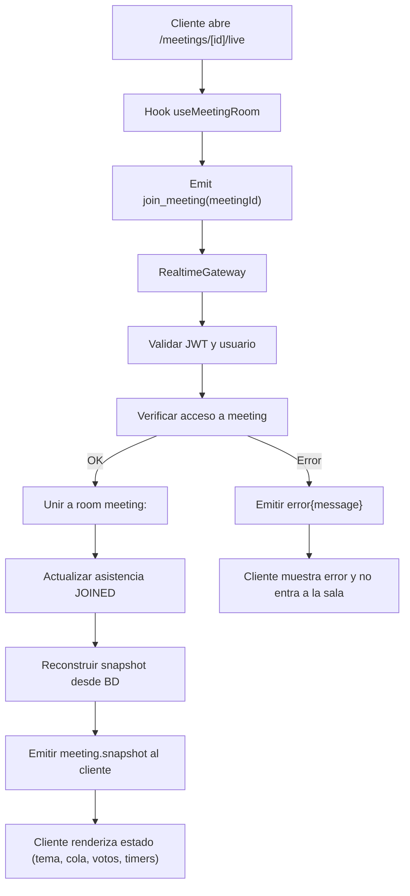

---

### 5. Flujos de negocio (diagramas de flujo)

#### 5.1 Crear y configurar una reunión

1. Secretaría accede a `/admin/meetings` y crea una reunión (`POST /meetings`).
2. El backend crea la `Meeting` en estado `DRAFT` y asigna participantes base (p. ej. presidentes de clubes habilitados).
3. Opcionalmente importa reuniones en bloque vía CSV.
4. Desde `/admin/meetings/[id]`, la secretaría:
   - Ajusta título, descripción y fecha.
   - Configura la agenda (`POST /meetings/:id/topics`, reorder).
   - Asigna/ajusta participantes (manual o CSV).
   - Adjunta documentos relevantes.

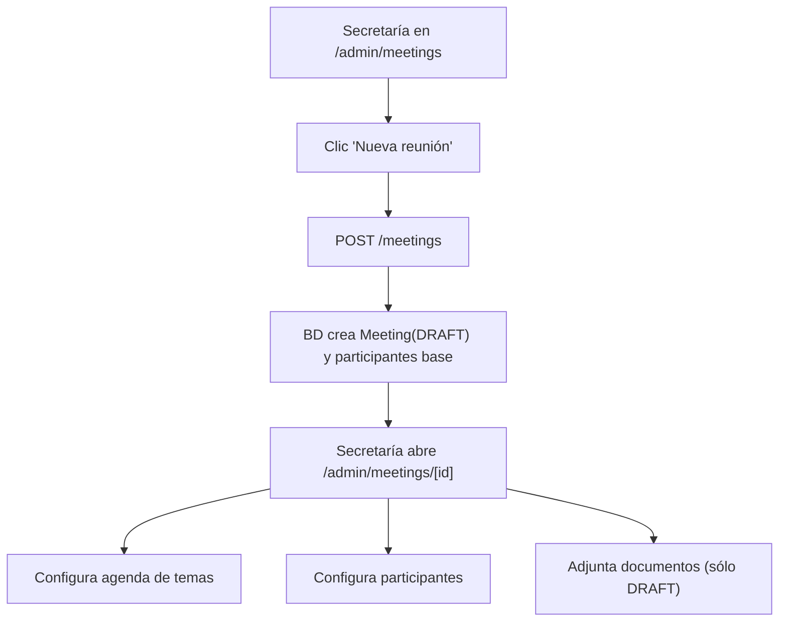

#### 5.2 Ciclo de vida de una reunión

Estados y transiciones principales:

- `DRAFT → SCHEDULED` (`POST /meetings/:id/schedule`).
- `DRAFT | SCHEDULED → LIVE` (`POST /meetings/:id/start`).
- `LIVE → PAUSED` (`POST /meetings/:id/pause`).
- `PAUSED → LIVE` (`POST /meetings/:id/resume`).
- `LIVE | PAUSED → FINISHED` (`POST /meetings/:id/finish`).

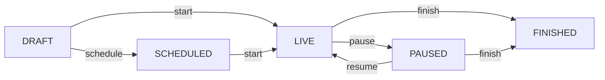

Cada transición:

- Valida la combinación de estado origen/destino.
- Registra un `AuditLog` con la acción.
- Reconstruye y emite un `meeting.snapshot` a todos los clientes conectados.

#### 5.3 Gestión de agenda y tema actual

1. Secretaría define los temas desde `/admin/meetings/[id]`.
2. Cuando la reunión está en `LIVE` o `PAUSED`, puede marcar un tema como actual.
3. El backend valida que el tema pertenece a la reunión y actualiza `currentTopicId`.
4. El snapshot refleja el tema actual para todos los participantes.

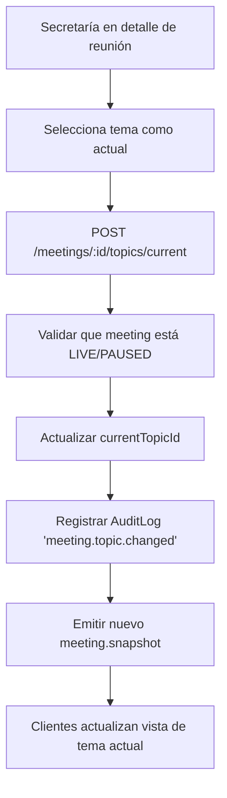

#### 5.4 Solicitud de palabra / cola de oradores

1. Participante en `/meetings/[id]/live` pulsa “Solicitar palabra”.
2. El frontend llama a `POST /meetings/:id/queue/request`.
3. El backend valida que la reunión está `LIVE`/`PAUSED` y que no hay otra solicitud pendiente para ese usuario.
4. Crea un `SpeakingRequest` con `status = PENDING` y `position` secuencial.
5. Emite un nuevo `meeting.snapshot` para mostrar la cola actualizada.
6. El participante puede cancelar la solicitud si sigue pendiente.
7. La secretaría puede fijar orador actual y siguiente.

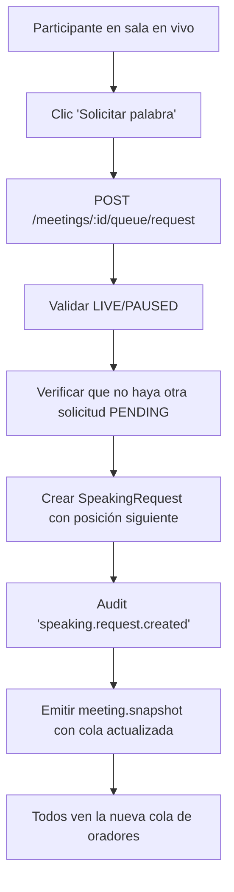

#### 5.5 Votaciones

1. Secretaría, desde `/admin/meetings/[id]/live`, abre una votación para un tema (`POST /meetings/:id/vote/open`).
2. Se crea una `VoteSession` y se emiten `meeting.vote.opened` + `meeting.snapshot`.
3. Participantes emiten su voto por HTTP o WS.
4. El backend valida permisos de voto y registra/actualiza el `Vote`.
5. Con cada voto se actualiza el conteo y se emite `meeting.vote.result`.
6. Secretaría cierra la votación (`POST /meetings/:id/vote/close`).
7. Se calcula el resultado final y se emiten `meeting.vote.closed` + `meeting.snapshot`.

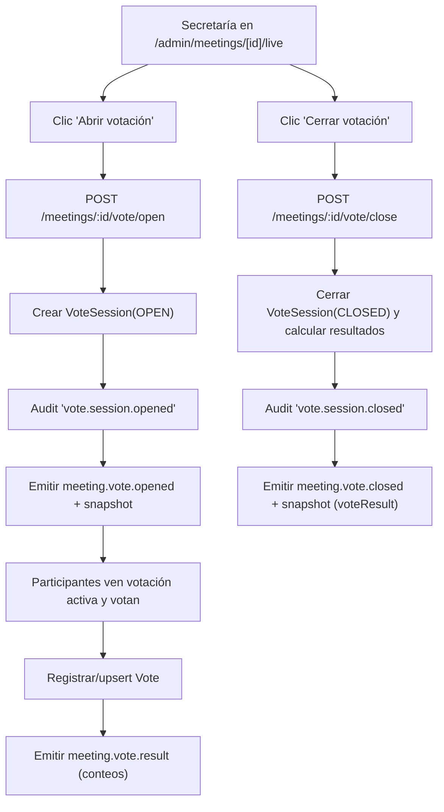

#### 5.6 Timers

1. Secretaría inicia un timer asociado al tema actual desde `/admin/meetings/[id]/live`.
2. El backend valida estado de la reunión y que no exista otro timer activo para ese contexto.
3. Se crea un `TimerSession` con `startedAt` y `plannedDurationSec`.
4. El snapshot expone el timer como activo; el frontend calcula/visualiza cuenta regresiva.
5. Al detener el timer, el backend calcula duración real y `overtimeSec`, actualiza la entidad y re-emite snapshot.

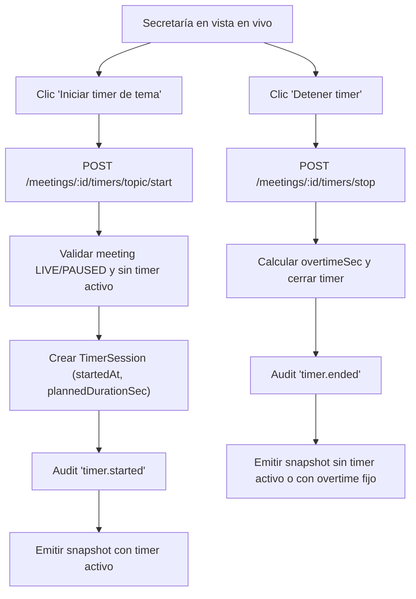

---

### 6. Diagramas de secuencia

#### 6.1 Participante entra a una reunión en vivo

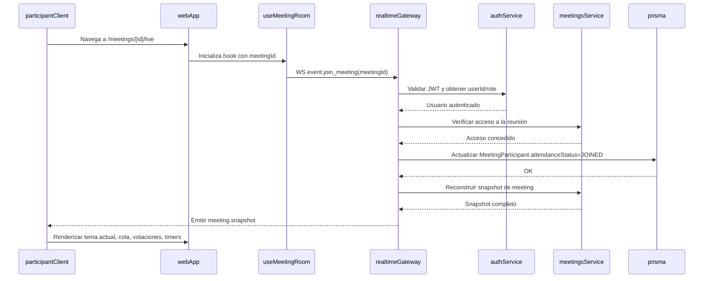

#### 6.2 Secretaría abre y cierra una votación

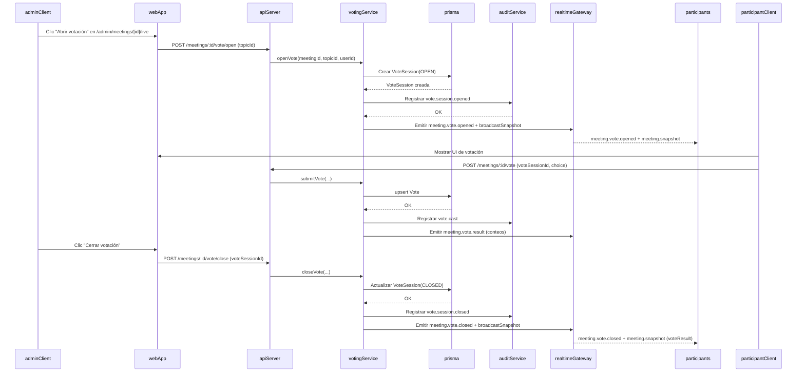

#### 6.3 Solicitud de palabra

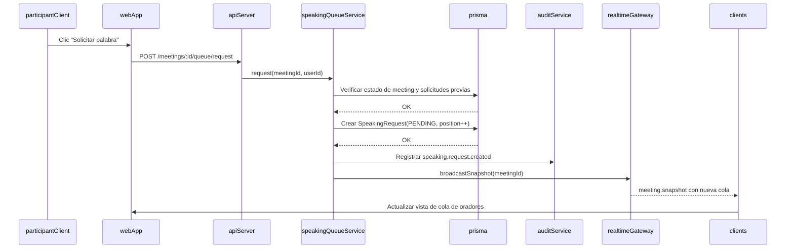

#### 6.4 Manejo de timers de tema

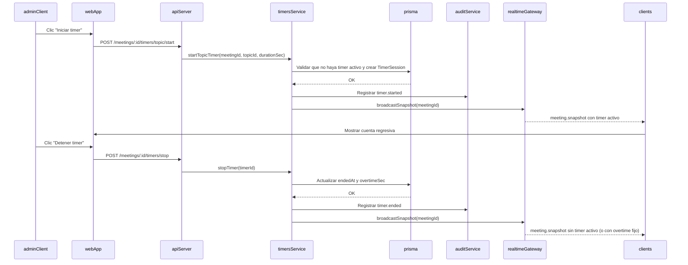

---

### 7. Vistas y UX por rol

#### 7.1 Rol participante / club

- **`/meetings`**
  - Lista las reuniones donde el usuario es participante o que están visibles según su estado.
  - Muestra título, club, fecha, estado y acceso al detalle.
- **`/meetings/[id]`**
  - Detalle de una reunión: datos básicos, estado y, si está `LIVE` o `PAUSED`, botón para entrar a la sala en vivo.
- **`/meetings/[id]/live`**
  - Vista principal del participante durante la reunión:
    - Tema actual (título, descripción básica, tipo).
    - Cola de oradores (posición propia y de otros).
    - Botón para solicitar/cancelar palabra (según estado actual).
    - Módulo de votación cuando hay una votación abierta.
    - Resumen de resultados cuando la votación se cierra.
    - Indicadores de conexión y reconexión al WebSocket.

El participante **no** puede:

- Crear/editar reuniones, temas o participantes.
- Abrir/cerrar votaciones.
- Controlar timers ni modificar la cola de otros.

#### 7.2 Rol secretaría / presidencia

- **`/admin/meetings`**
  - Listado de reuniones administrables:
    - Acciones: crear reunión, importar reuniones por CSV.
- **`/admin/meetings/[id]`**
  - Configuración completa:
    - Header con estado, fechas y club.
    - Botones para programar, iniciar, pausar, reanudar y finalizar la reunión.
    - Gestión de agenda (alta, edición, eliminación, reordenamiento, marcar tema actual).
    - Gestión de participantes (lista y carga masiva).
    - Adjuntos de la reunión (visible principalmente en `DRAFT`).
- **`/admin/meetings/[id]/live`**
  - Cabina de control en vivo:
    - Mismos elementos visibles que el participante (tema actual, cola, votaciones, timers).
    - Controles adicionales:
      - Cambiar tema actual.
      - Abrir/cerrar votaciones.
      - Iniciar/detener timers.
      - Gestionar cola de oradores (marcar orador actual y siguiente).

#### 7.3 Vista tipo proyector

No existe una ruta exclusiva de “proyector”, pero el sistema está preparado para usar:

- `/meetings/[id]/live` o `/admin/meetings/[id]/live` en una pantalla grande, con un usuario dedicado y sin interacción.
- Recomendaciones:
  - Mantener sesión fija en un navegador en modo pantalla completa.
  - Desactivar interacciones innecesarias (no usar controles de administración en el proyector).
  - Usar la vista que mejor represente el estado general (tema actual, resultados de votaciones, próximos oradores).

---

### 8. Manual de uso (operativo)

#### 8.1 Como secretaría

1. **Crear una reunión**
   - Ir a `/admin/meetings`.
   - Pulsar “Nueva reunión”.
   - Completar título, club, fecha y descripción.
   - Guardar; la reunión queda en estado `DRAFT`.
2. **Importar reuniones por CSV (opcional)**
   - Desde `/admin/meetings`, usar la opción de importación.
   - Descargar la plantilla, completarla y subirla.
3. **Configurar agenda de temas**
   - Abrir `/admin/meetings/[id]`.
   - En la sección de agenda, crear uno o más temas (discusión, votación, informativo).
   - Ajustar el orden arrastrando o usando herramientas de reordenamiento.
4. **Cargar participantes**
   - En la sección de participantes, agregar o importar por CSV.
   - Marcar quiénes pueden votar (`canVote = true`).
5. **Adjuntar documentos**
   - Mientras la reunión esté en `DRAFT`, subir actas, presentaciones u otros archivos.
6. **Poner la reunión en vivo**
   - Opcionalmente programar (`SCHEDULED`) y luego iniciar (`LIVE`).
   - Desde el encabezado, usar los botones `Programar`, `Iniciar`, `Pausar`, `Reanudar` y `Finalizar` según corresponda.
7. **Gestionar la cola de oradores**
   - Abrir `/admin/meetings/[id]/live`.
   - Observar la cola de oradores; fijar orador actual y siguiente.
   - Responder a solicitudes de palabra si el flujo lo requiere (aceptar, gestionar orden).
8. **Abrir y cerrar votaciones**
   - En la vista en vivo, posicionarse en el tema correspondiente.
   - Pulsar “Abrir votación”; verificar que los participantes ven el módulo de voto.
   - Supervisar conteos en tiempo real.
   - Pulsar “Cerrar votación” cuando corresponda; compartir resultados agregados.
9. **Usar timers**
   - Iniciar timer de tema u orador al comenzar la intervención.
   - Seguir el tiempo restante en la UI.
   - Detener el timer al finalizar; la herramienta registra overtime.
10. **Consultar historial**
    - Tras finalizar la reunión, acceder a las vistas de historial para revisar reuniones y resultados de votación.

#### 8.2 Como participante / presidente de club

1. **Ver próximas reuniones**
   - Entrar a `/meetings`.
   - Revisar la lista de reuniones asignadas (con fecha y estado).
2. **Entrar a una reunión en vivo**
   - Desde la lista o el detalle `/meetings/[id]`, pulsar “Entrar a la sala en vivo” cuando la reunión esté `LIVE` o `PAUSED`.
3. **Solicitar palabra**
   - En la vista en vivo, pulsar “Solicitar palabra”.
   - Ver tu posición en la cola.
   - Si ya no deseas hablar, cancelar mientras la solicitud esté pendiente.
4. **Votar**
   - Cuando la secretaría abra una votación, aparecerán las opciones de voto.
   - Seleccionar `Sí`, `No` o `Abstención` y confirmar.
   - Verás en la UI que tu voto fue registrado (estado de `ownVote`).
5. **Ver resultados**
   - Una vez cerrada la votación, observar el resumen de resultados agregados (no nominal).

#### 8.3 Buenas prácticas en reuniones en vivo

- Conectar desde una red estable antes del inicio.
- Mantener una única pestaña de la sala en vivo abierta por usuario.
- Si se pierde la conexión, recargar la página para forzar una nueva unión al WebSocket.
- Coordinar con la secretaría qué pantalla se usará como proyector y evitar interactuar en ella.

---

### 9. Seguridad, roles y auditoría

- **Roles mínimos**:
  - `SUPER_ADMIN` (si se usa a nivel global del sistema).
  - `SECRETARY`.
  - `PRESIDENT`.
  - `PARTICIPANT` (otros usuarios con acceso limitado).
- **Reglas de acceso clave**:
  - Sólo `SECRETARY` y `PRESIDENT` crean, editan y cambian el estado de reuniones.
  - Sólo `SECRETARY` y `PRESIDENT` abren/cierran votaciones y ven detalle nominal de votos.
  - Un participante sólo puede:
    - Ver reuniones donde está invitado o que sean públicas dentro del distrito.
    - Entrar a la sala en vivo si es participante autorizado.
    - Votar si tiene `canVote = true`.
  - El backend nunca confía en el rol enviado por el frontend; siempre se valida con JWT + base de datos.
- **Auditoría obligatoria**:
  - Se registran en `AuditLog` acciones como:
    - Creación/edición de reunión.
    - Cambios de estado (start/pause/resume/finish).
    - Asignación/cambio masivo de participantes.
    - Apertura/cierre de votaciones.
    - Emisión de votos (`vote.cast`).
    - Cambios de tema actual y de orador actual/siguiente.
    - Inicio y fin de timers.
    - Join/leave de participantes en salas en vivo.
- **Integridad y restricciones**:
  - Un usuario no puede votar dos veces en la misma sesión gracias a la constraint única y al uso de `upsert`.
  - Timers y votaciones sólo se permiten en reuniones `LIVE` o `PAUSED`.
  - La cola de oradores impide solicitudes duplicadas pendientes para el mismo usuario.

---

### 10. Anexos técnicos

- **Backend**:
  - Módulo de reuniones: `apps/api/src/meetings/`.
  - Gateway de tiempo real: `apps/api/src/realtime/realtime.gateway.ts`.
  - Modelo de datos: `apps/api/prisma/schema.prisma` (sección `Meeting` y relacionadas).
- **Frontend**:
  - Vistas de participante: `apps/web/src/app/meetings/`.
  - Vistas de administración: rutas bajo `apps/web/src/app/admin/meetings/`.
  - Hook de sala en vivo: `useMeetingRoom` (en capa de hooks/composables).
- **Extensibilidad sugerida**:
  - Nuevos tipos de tema (`TopicType`) para otras dinámicas.
  - Más opciones de voto (ampliando `VoteChoice` y la UI asociada).
  - Vista de proyector dedicada con layout específico pero reutilizando el snapshot actual.

